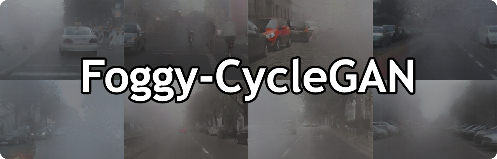
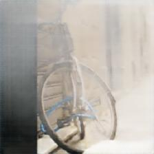

# Foggy-CycleGAN

 

This project is the pre-processing procedure (rendering) for All Weather high-level task (Recognition).

## Description
**Foggy-CycleGAN** is a
<a href="https://junyanz.github.io/CycleGAN/" target="_blank">CycleGAN</a> model trained to synthesize fog on clear images.

## Pre-trained Models
A version of pre-trained models used in the thesis can be found [here](https://drive.google.com/drive/folders/1QKsiaGkMFvtGcp072IG57MfY1o_D-L3k?usp=sharing).

## Notebook 
A Jupyter Notebook file <a href="https://github.com/ghaiszaher/Foggy-CycleGAN/blob/master/Foggy_CycleGAN.ipynb" target="_blank">Foggy_CycleGAN.ipynb</a> is available in the repository.
 
## Using
To utilize this code and generate foggy images. You only have to run <a href="https://github.com/Blackpinkup/Foggy-CycleGAN/inference.py" target="_blank">inference.py</a>. Note that you have to modify your image path in inference.py.

## Results

 

 origin image

 

 haze 0.25

 

 haze 0.5

 

 haze 0.75

